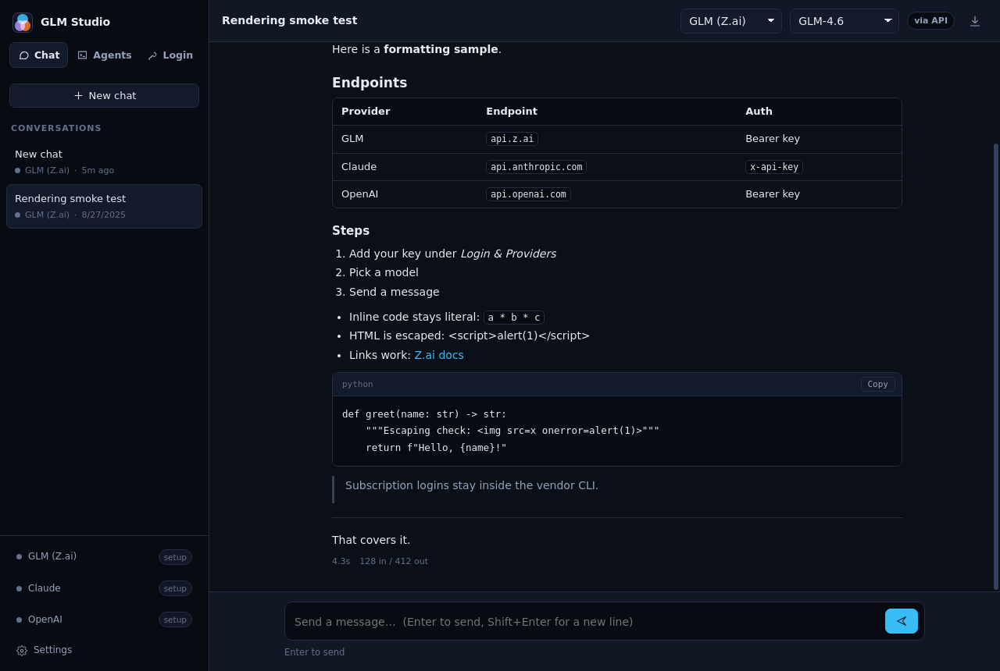
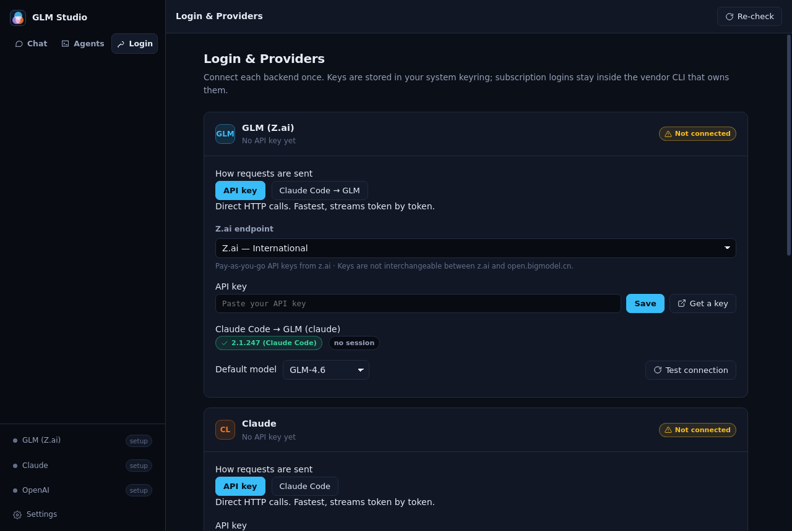
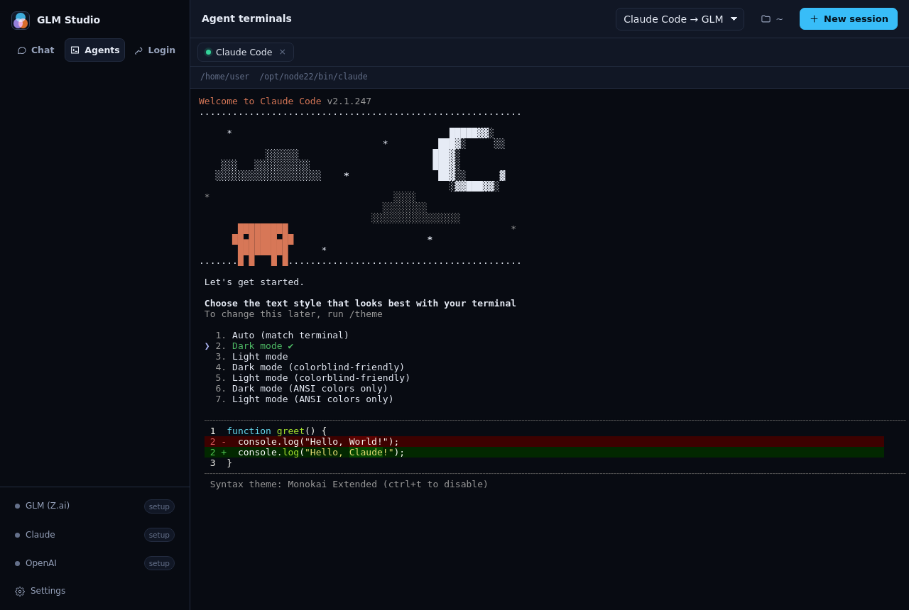

# GLM Studio

A Linux desktop app for **GLM** (Zhipu / Z.ai), **Anthropic Claude**, and **OpenAI** — chat with
all three from one window, and drive the **Claude Code** and **Codex** agents in an embedded
terminal.

GLM has no first-party desktop client on Linux. GLM Studio fills that gap, and since it had to
solve authentication and streaming anyway, it does the same for Claude and OpenAI: one app, one
login screen, three backends.



---

## What it does

**Chat** — Streaming conversations against any of the three backends. Switch model or backend from
the header. Markdown, tables, syntax-preserving code blocks with copy buttons, and a collapsible
panel for reasoning models that expose their thinking.

**Agents** — Real terminals running `claude` and `codex` in a working directory you choose. Not a
chat wrapper around an API: the actual CLI, with its tools, file edits, and permission prompts.
Choosing GLM points Claude Code at Z.ai's Anthropic-compatible endpoint, so the same agent runs
on GLM models.

**Login** — API keys stored in your OS keyring, or a subscription sign-in handled by the vendor's
own CLI. Both routes are first-class; you pick per provider.

| | Chat via API key | Chat via CLI | Agent terminal |
|---|---|---|---|
| GLM (Z.ai) | ✅ | ✅ via Claude Code → Z.ai | ✅ |
| Claude | ✅ | ✅ Pro/Max subscription | ✅ |
| OpenAI | ✅ | ✅ ChatGPT Plus/Pro subscription | ✅ |

---

## Install

Requires Node.js 20+ and a Linux desktop.

```bash
git clone https://github.com/likosubakti/nanoclaw.git glm-studio
cd glm-studio
npm install
npm run install:desktop     # builds, then adds the launcher entry and icons
```

`GLM Studio` now appears in your application launcher, and `glm-studio` is on your `PATH` (assuming
`~/.local/bin` is). Everything installs under `$HOME` — no root required. To install system-wide:

```bash
npm run build && sudo bash scripts/install-desktop.sh --system
```

To remove the launcher (settings and keys are kept):

```bash
npm run uninstall:desktop
```

### Packaged builds

```bash
npm run dist        # AppImage, .deb, .rpm, and .tar.gz into release/
```

### Run without installing

```bash
npm run dev         # hot-reloading development build
npm start           # build once and run
```

---

## Connecting your accounts

Open **Login & Providers** in the sidebar. Each backend offers two routes.



### GLM (Z.ai)

GLM authenticates with an API key. Pick the endpoint that matches where your key came from — they
are **not** interchangeable:

| Endpoint | Base URL | Use when |
|---|---|---|
| Z.ai — International | `https://api.z.ai/api/paas/v4` | Pay-as-you-go keys from z.ai |
| Z.ai — Coding Plan | `https://api.z.ai/api/coding/paas/v4` | You subscribe to the GLM Coding Plan |
| Bigmodel — Mainland China | `https://open.bigmodel.cn/api/paas/v4` | Keys from open.bigmodel.cn |

Click **Get a key** to open the key page in a window, sign in there, create a key, and paste it
back. Bigmodel's `{id}.{secret}` key format is detected automatically and exchanged for the signed
JWT that platform expects — paste it as-is.

### Claude

Either an API key from the Anthropic Console, **or** your Claude Pro/Max subscription. For the
subscription, set the transport to *Claude Code* and click **Sign in with Claude** — the `claude`
CLI runs its own browser sign-in in a terminal tab and keeps the session itself.

### OpenAI

Either an API key from the OpenAI Platform, **or** your ChatGPT Plus/Pro subscription. For the
subscription, set the transport to *Codex CLI* and click **Sign in with ChatGPT**.

### The two transports

Every provider can be reached two ways, chosen per provider in Settings or on the Login screen:

- **API key** — direct HTTPS to the vendor. Fastest, streams token by token, no CLI needed.
- **CLI** — the request is handed to `claude` or `codex`. Slower to start, but a subscription plan
  works, and the agent's tools are available.

Subscription credentials are the reason the CLI transport exists: a Claude Pro or ChatGPT Plus login
is not a valid bearer token for the public APIs. Rather than try to reuse those tokens, GLM Studio
hands the work to the CLI that owns them.

---

## Agent terminals



Pick a backend and a working directory, then **New session**. The CLI starts in a real pty, so its
full interactive UI works — permission prompts, slash commands, everything.

Missing CLIs are reported with the install command:

```bash
npm install -g @anthropic-ai/claude-code    # claude
npm install -g @openai/codex                # codex
```

Selecting **Claude Code → GLM** sets `ANTHROPIC_BASE_URL` and `ANTHROPIC_AUTH_TOKEN` for that
session only, so Claude Code talks to Z.ai. Your shell environment is untouched, and a stray
`ANTHROPIC_API_KEY` in your profile is explicitly removed from the child environment so it cannot
silently bill your Anthropic account instead.

---

## Keyboard shortcuts

| Shortcut | Action |
|---|---|
| `Ctrl+N` | New chat |
| `Ctrl+T` | New agent terminal |
| `Ctrl+1` / `Ctrl+2` / `Ctrl+3` | Chat / Agents / Login |
| `Ctrl+,` | Settings |
| `Ctrl+S` | Export conversation as Markdown |
| `Enter` | Send (configurable to `Ctrl+Enter`) |
| `Esc` | Stop the current response |

---

## Where your data lives

| Path | Contents |
|---|---|
| `~/.config/glm-studio/settings.json` | Preferences |
| `~/.config/glm-studio/secrets.json` | API keys, encrypted (mode `0600`) |
| `~/.local/share/glm-studio/conversations/` | One JSON file per conversation |
| `~/.local/state/glm-studio/glm-studio.log` | Application log |

Nothing is sent anywhere except the provider endpoint you selected. There is no telemetry.

### How credentials are handled

- API keys are encrypted with Electron's `safeStorage`, which uses libsecret (GNOME Keyring /
  KWallet) on Linux.
- **Without a keyring**, `safeStorage` cannot encrypt. Keys then fall back to base64 in a `0600`
  file — obfuscation, not protection — and Settings → Diagnostics says so. Install `gnome-keyring`
  or `kwalletmanager` for real encryption.
- Subscription tokens are never read, copied, or forwarded. GLM Studio only checks whether the CLI
  has a session and who it belongs to.
- An API key sitting in a CLI's own config is offered as an explicit one-click import, never
  adopted silently.
- Authorization headers are redacted before anything reaches the log.

---

## Troubleshooting

**A CLI is installed but the app says it is missing.** Apps launched from a desktop menu inherit a
minimal `PATH` that usually excludes npm's global bin. GLM Studio already searches the common
locations (`~/.local/bin`, `~/.npm-global/bin`, `~/.bun/bin`, nvm and fnm directories, `/snap/bin`).
If yours is elsewhere, set the absolute path under **Settings → Advanced → CLI path**.

**Terminals say "pipe mode".** `node-pty` is a native module that must match Electron's ABI. Rebuild
it — the app keeps working in the meantime, just without interactive prompts:

```bash
npx electron-builder install-app-deps
```

**401 from GLM.** Almost always an endpoint mismatch: a Coding Plan key on the general endpoint, or
a z.ai key against `open.bigmodel.cn`. Check the endpoint selector on the Login screen.

**403 with a valid key.** The key is not entitled to that model. Try a different model, or the
endpoint that matches your plan.

**Window opens off-screen or blank.** Delete `~/.config/glm-studio/window-state.json`. For GPU
driver problems, launch with `GLM_STUDIO_DISABLE_GPU=1 glm-studio`.

**Diagnostics.** Settings → Diagnostics has a *Copy diagnostics* button that summarises versions,
paths, credential backend, and per-provider status.

---

## Development

```bash
npm run dev         # esbuild watch + auto-restarting Electron
npm test            # unit tests (node:test)
npm run typecheck   # tsc --noEmit
npm run build       # production bundles into dist/
npm run icons       # regenerate resources/icons from the built-in rasteriser
```

Environment variables:

| Variable | Effect |
|---|---|
| `GLM_STUDIO_DEV=1` | Opens DevTools, enables debug logging |
| `GLM_STUDIO_DEBUG=1` | Debug logging only |
| `GLM_STUDIO_DISABLE_GPU=1` | Disables hardware acceleration |
| `GLM_STUDIO_WORKSPACE` | Default agent working directory |

Keys are also read from `ZAI_API_KEY`, `ZHIPUAI_API_KEY`, `GLM_API_KEY`, `ANTHROPIC_API_KEY`, and
`OPENAI_API_KEY` when nothing is stored.

Further reading: [docs/ARCHITECTURE.md](docs/ARCHITECTURE.md) ·
[docs/PROVIDERS.md](docs/PROVIDERS.md) · [docs/LOGIN.md](docs/LOGIN.md)

---

## License

MIT — see [LICENSE](LICENSE).

Not affiliated with Zhipu AI, Z.ai, Anthropic, or OpenAI. Product names are the trademarks of their
respective owners.
