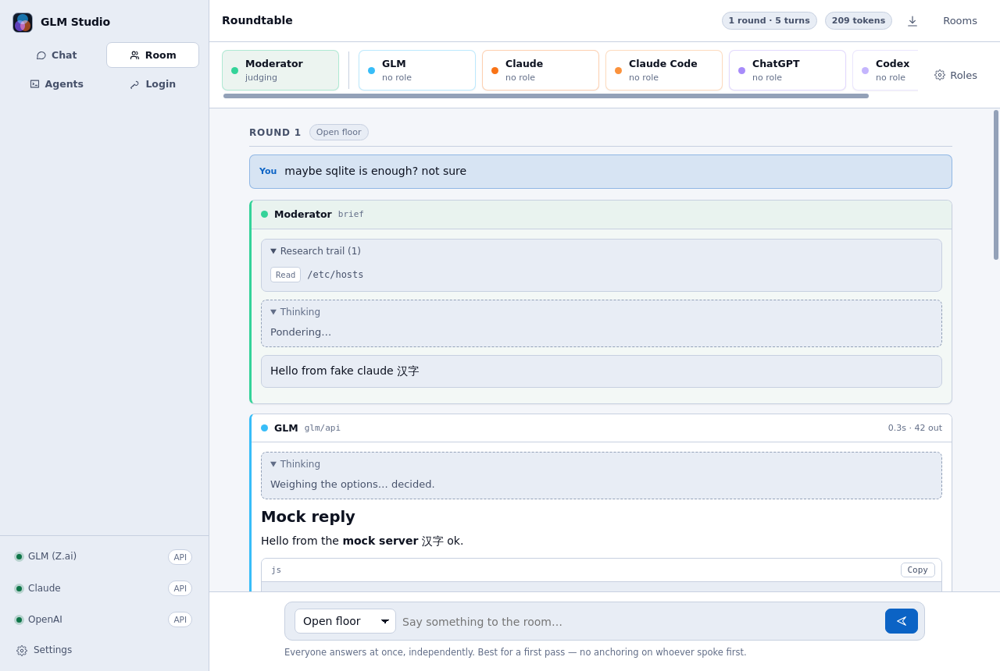
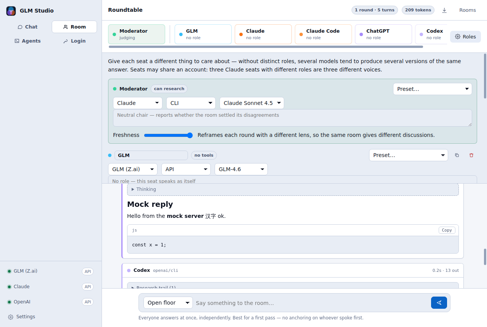

# The Roundtable

Several backends discussing one topic while you watch them think, research, and argue.
Sidebar → **Room**, or `Ctrl+2`.

---

## Seats

A seat is one participant: a backend, a model, a name, and a role.

Seats are provider × transport pairs, which is why ChatGPT and Codex — or Claude and Claude Code —
are distinct voices rather than duplicates. Same vendor, different capabilities: the CLI seats have
tools and can search the web, the API seats reason from what they know.

**Seats may share an account.** Three Claude seats can sit as cryptographer, cybersecurity lead and
technical director. They are three different voices because their roles differ, not their billing.
Add, duplicate and remove seats in the **Roles** panel.

> A plain API seat has no tools, so it never visits a website. Its Thinking panel fills; its
> Research trail stays empty. That is not a bug, and the seat chip says `no tools` so you can tell
> at a glance.

## Roles

A role is the single biggest lever on whether five models produce five versions of the same answer
or a real argument. Each preset gives a seat something distinct to optimise for *and* something
distinct to object to:

CTO · CPO · CEO · Mathematician · Staff engineer · Security lead · Data scientist ·
Devil's advocate · User advocate · Systems architect · Cryptography specialist ·
Cybersecurity specialist · SRE · Performance engineer · Compliance · Cost analyst · Prior art

Pick a preset to fill the box, then edit it freely — the text is the prompt.

## The moderator

The moderator is **not** a participant. It does three things the seats cannot do for themselves:

1. **Writes the brief.** You type a rough thought — *"maybe sqlite is enough? not sure"* — and it
   turns that into a precise agenda, then writes **each seat a different instruction aimed at its
   specialism**. A brief that would read the same to a cryptographer and a product lead is a failed
   brief, and it is told so.
2. **Researches.** Seated on a CLI backend it can check a fact before briefing or ruling.
3. **Rules.** At the end of every round it decides whether the discussion is finished.

**The moderator can hold a role too.** Left blank it is a neutral chair, and concludes only when the
room has genuinely settled its disagreements. Give it a role — *"CTO — you make the final call"* —
and it stops counting votes: it concludes when it has what it needs to decide, and says which way
it is deciding.

Its own thinking and research stream into the transcript like any seat's. A judge whose reasoning
is hidden is just an oracle.

If the moderator is turned off, the room falls back to asking each seat to vote at the end of a
round, and concludes when they unanimously agree.

## Freshness

Run the same room twice with the same seats and the same topic and you would get the same
discussion — identical inputs converge on identical framing.

The **Freshness** dial fixes that. Each round the moderator is handed a different lens sampled from
a fixed set, and shown which lenses the room has already used:

> *Invert it: ask what would have to be true for the opposite choice to be right.*
> *Reason backwards from the most likely failure, not forwards from the plan.*
> *Ask who bears the cost of being wrong, and whether they are in the room.*
> *Frame it as a bet: what odds would each participant actually take?*

The dial also sets the moderator's sampling temperature. Briefs run hot, rulings run cool — you want
variance in the question, not in the verdict. Turn it down for a plain, repeatable framing.

## Rounds

You choose the protocol each time you speak, not once for the room:

| Mode | What happens |
|---|---|
| **Open floor** | Everyone answers at once, independently. Nobody anchors on whoever spoke first. |
| **Go around** | Seats speak in turn, each building on what was said this round. |
| **Cross-examine** | Each seat challenges the others by name and says where it changed its mind. |
| **Ask directly** | Put a question to specific seats only. |
| **Wrap up** | One seat writes the conclusion. |

Only *Open floor* runs seats concurrently — a conversation has to be ordered.

## How it ends

There is **no round cap**. The room runs until the moderator concludes or you close it. When a room
is not converging it says so loudly (*"Still split — 2 of 5 agree"*) rather than quietly looping.

Because the room can run indefinitely and every seat sees the full transcript on every turn, cost
grows quickly. The header carries a live token counter and a **Stop** button that aborts every seat
mid-flight. Neither caps your spend — they make it visible.

## When something fails

Failure is contained by design:

- One backend being down records a failed turn and **the round continues** with the other seats.
- A moderator that falls over degrades to un-tailored instructions rather than ending the room.
- A brief that ignores the output format still yields a usable agenda.
- A ruling that cannot be parsed is read as **continue**, never as *conclude* — the room stays open
  rather than declaring a conclusion nobody reached.

## Exporting

The download button writes the whole discussion to Markdown: every turn, every research trail with
its URLs, the moderator's briefs and rulings, and the conclusion.

## Watching from your phone

See [TELEGRAM.md](TELEGRAM.md).
